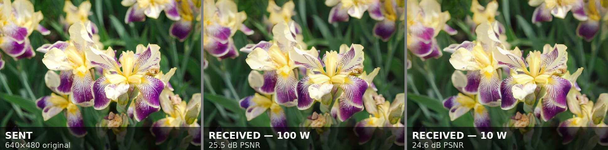
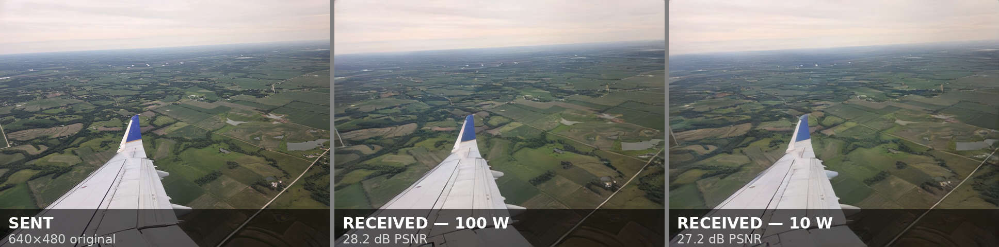
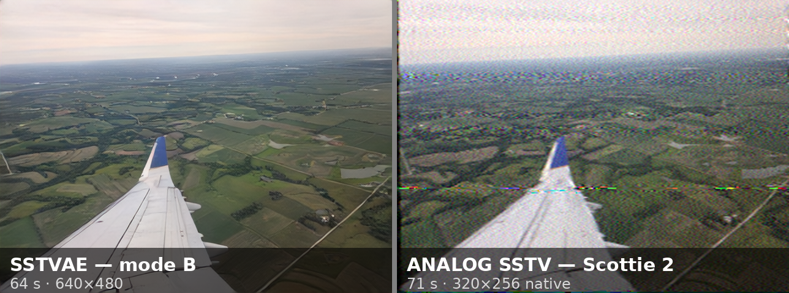

# SSTVAE

**Send pictures over HF radio using a neural image codec instead of scanlines or file bytes.**

SSTVAE is an experimental amateur-radio image mode. A convolutional
autoencoder compresses your image into a few hundred thousand
*continuous-valued* numbers ("latents"), and those numbers are sent
directly as OFDM carrier amplitudes — no bits, no packets, no JPEG. The
decoder network is trained with a simulated HF channel in the loop, so
noise and fading push the picture quality gently downhill instead of
breaking it.

It is directly inspired by [FreeDV RADE](https://freedv.org/radio-autoencoder/)
(the "radio autoencoder"), which does the same trick for speech.





**Actually over the air.** Mode B (64 s) on 20 m, transmitted from New
Jersey. Top row received at the
[Northern Utah WebSDR](http://www.sdrutah.org/) in Corinne, Utah —
**3150 km**. Bottom row received in Minnesota — **1700 km**. In both,
the middle panel is 100 W and the right panel is **10 W**, sent back to
back over the same path. One tenth the power costs about 1 dB of
picture: it gets slightly softer rather than breaking up, which is the
whole idea.

> ### ⚠️ Status: working beta
>
> It works on real HF, as above. But:
>
> - **The on-air format is not frozen.** Expect incompatible changes.
>   Two stations must run the same commit *and* the same model
>   checkpoint to talk to each other.
> - **It is not yet packaged.** There is a desktop app now (`sstvae-gui`,
>   with rig control), but you still install it from source, and there is
>   no integration with existing SSTV software.
> - Not registered with, or coordinated with, any band-plan authority.
>   Use it thoughtfully and identify per your licence.
>
> If you want something that just works and interoperates with the rest
> of the world today, use MMSSTV or an existing digital SSTV mode. If
> you want to help shake out a new one, read on.

## What makes it different

**Analog SSTV** fails softly — noise looks like noise — but QRM tears a
band across the image, lost sync slants the frame, and tuning in late
means the top of the picture is simply gone.

**HamDRM** and **SSDV** send a compressed file. While the FEC holds, the
picture is pixel-perfect; when it doesn't, you lose whole blocks or the
image outright. That's the digital cliff: excellent, excellent,
excellent, nothing.

SSTVAE aims at the middle. Latents are real numbers, so channel noise
adds to them instead of corrupting a bitstream — there's no threshold to
fall off. And a fixed interleaver scatters every frame's latents across
the whole picture, so losing part of a transmission dims detail
*everywhere* slightly rather than removing a region.



The same picture between the same two stations, on the same frequency,
100 W both, a few minutes apart — and comparable airtime, 64 s against
71 s. The analog copy shows what the channel did to it: impulse noise as
coloured streaks, speckle through the sky, softened detail. The SSTVAE
copy absorbed the same channel into a slightly softer picture.

One comparison on one path at one moment isn't a controlled study —
propagation shifts minute to minute. And Scottie 2 is 320×256 *by
design*; it isn't failing, it's doing its job at its own resolution.

| | Analog SSTV | HamDRM | SSDV | SSTVAE |
|---|---|---|---|---|
| Payload | Scanlines as tones | Compressed file + FEC | JPEG in FEC'd packets | Autoencoder latents |
| Degradation | Gradual, but localized damage | Digital cliff | Lost packets = missing blocks | Gradual, spread over whole image |
| Missed the start? | Top of image lost | Usually unrecoverable | Depends on transport | **Whole image**, softer — never a missing region |
| Bandwidth | ~1200 Hz, most modes | 2200 or 2500 Hz | Depends on transport | ~1200 Hz |
| Time on air | 36–120 s, common modes | ~30–180 s, varies with size and FEC | Depends on transport and size | 32 / 64 / 95 s |
| Needs a trained model | No | No | No | **Yes — both ends** |
| Exactness | Faithful-but-noisy | Exact or nothing | Exact, or blocks missing | Reconstruction, never exact |

SSDV is a packet format, not a mode — its bandwidth and timing depend
entirely on how you carry it.

SSTVAE targets the same airtime and bandwidth as the common analog
modes. The bandwidth saving is only against HamDRM, and frame size isn't
a differentiator either: PD120 already sends 640×496 in 126 s. The claim
is picture quality for comparable time on air.

Two caveats on the last two rows:

**You need the model.** The network *is* the codec, so both stations
need the same ~40 MB checkpoint — an interoperability cost analog SSTV
doesn't have.

**It's a reconstruction, not a photograph.** The decoder produces the
most plausible image consistent with the latents that arrived. Fine
detail, small text especially, can come back subtly wrong rather than
merely blurry — and it looks confident either way. Judge it by how the
pictures look, not the pixel count, and don't use it where exactness
matters.

## Performance

Measured end-to-end (encode → modem → simulated channel → modem →
decode) on 25 validation images never seen in training, at 640×480.
PSNR in dB; higher is better.

**AWGN** (SNR in a 2.5 kHz noise bandwidth):

| Mode | Time | clean | 20 dB | 10 dB | 6 dB | 3 dB | 0 dB | −2 dB |
|---|---|---|---|---|---|---|---|---|
| A | 32 s | 25.9 | 25.9 | 25.5 | 24.9 | 24.1 | 22.6 (22/25) | 21.5 (14/25) |
| B | 64 s | 27.0 | 26.9 | 26.6 | 26.1 | 25.4 | 24.1 (21/25) | 23.0 (11/25) |
| C | 95 s | 27.4 | 27.4 | 27.1 | 26.7 | 26.0 | 24.9 (20/25) | 23.8 (11/25) |

**Watterson "poor" multipath** (`mpp`: 2 ms second-path delay, 1 Hz Doppler spread):

| Mode | 20 dB | 10 dB | 6 dB |
|---|---|---|---|
| A | 25.1 (24/25) | 24.6 (24/25) | 24.0 (19/25) |
| B | 26.2 | 25.7 | 24.8 (24/25) |
| C | 26.8 | 26.2 (24/25) | 25.5 (22/25) |

Reproduce with `python scripts/snr_sweep.py`.

A bracketed fraction is how many of the 25 transmissions acquired sync at
all; the PSNR beside it averages only those, so read the pair as "how
often you get a picture, and how good it is when you do". Where no
fraction is shown, all 25 decoded with **100% of frames**. Across the
whole range where acquisition is reliable — 20 dB down to 3 dB — mode C
gives up just 1.4 dB of PSNR for a 17 dB drop in channel SNR, and that
gentle slope is the entire point of the design.

Don't read the on-air results at the top of this page straight off these
rows: absolute PSNR depends far more on the picture than on the channel.
The irises scored 25.5 dB at 100 W and 24.6 dB at 10 W, below most of
the mode B row; the airplane shot scored 28.2 / 27.2 dB, above all of
it. That gap is iris petals versus a smooth sky, not one path being
better than the other, and the table's own images span a comparable
range.

What *is* comparable is the difference between two passes of the same
image over the same path. Dropping 10 dB of power moved the picture by
0.9 dB on the Utah path and 1.0 dB on the Minnesota one — the same
shallow slope the table shows, arrived at over real ionosphere.

**Where it actually breaks:** the limit is acquisition, not image
quality. Down to 3 dB every transmission is detected; by 0 dB about a
fifth are missed, and at −2 dB more than half — and a missed preamble
means no image at all rather than a poor one. So the cliff hasn't been
abolished, it has been moved off the picture and onto the sync problem,
which is a much better place for it: the pictures that do arrive at
−2 dB are still worth looking at.

Acquisition is probabilistic once fading is involved, because it depends
on the preamble not landing in a deep fade. At 6 dB with a 43 Hz
frequency offset, mode C sync succeeded on 20–22 of 25 random channel
realizations across the three fading presets — an individual over can
miss even when conditions are nominally fine. The beacon's mid-stream
resync is the safety net here: it gets a second chance every ~10 s for
the whole length of the transmission, rather than one chance at the
start.

Other measured properties:

- **Envelope PAPR ≈ 4.5 dB** for a real transmission. This matters
  because amateur transmitters are peak-power-limited: every dB of PAPR
  is a dB of average power you don't get to transmit. The network is
  explicitly trained to keep its latents' crest factor low.
- **Frequency offset tolerance > ±50 Hz** — no need to zero-beat.
- **Late lock costs nothing.** If you were already recording but the
  preamble was buried in noise or a fade, the beacon lets the decoder
  work out where it is partway through and then decode everything it
  captured — including the frames from before it locked on. Full
  quality; the transmission is all there.
- **Tuning in late costs fidelity, not area.** If you genuinely joined
  partway, the earlier frames were never received. You still get a
  complete picture rather than a truncated one — no lost scanlines, no
  missing blocks — but a softer one, and the later you join the softer
  it gets (see below).

## How it works

One of the 24 carriers is permanently reserved for a **beacon
side-channel**: a continuously repeating, Golay-coded packet carrying an
absolute frame counter and an optional 8-character callsign. Because
that counter is absolute rather than relative, a receiver that never
heard the transmission's start can recover its exact position in the
stream from any ~10 s window — and then decode frames it recorded
*before* it locked on. This costs about 4.2% of latent capacity but no
airtime.

That last part is worth separating from a superficially similar case:

- **The preamble was lost, but you were recording.** The beacon recovers
  your position and the buffered frames decode normally. Nothing is
  missing, so the picture is as good as the noise allows. This is what
  the beacon was built for, and it is the common failure it rescues.
- **You tuned in partway.** The earlier frames never reached you and
  decode as erasures. The beacon still tells the receiver where it is,
  so the picture is complete rather than truncated — but it is a
  lower-fidelity picture, and how much lower depends on *what* you
  missed.

The three modes are **nested**: the latents are ordered into 3 groups,
and modes A/B/C send 1/2/3 of them. Mode A's transmission is literally a
prefix of mode C's. A mode C reception can therefore be decoded
progressively as it arrives, and a truncated or partly-faded reception
simply decodes at lower fidelity.

That ordering is what decides the price of tuning in late, because the
groups go out in order and group 0 — the base layer that B and C only
refine — goes out first. Mode C on a clean channel, 12 validation
images, by how late you started listening:

| joined at | 0 s | 16 s | 32 s | 48 s | 64 s | 80 s |
|---|---|---|---|---|---|---|
| PSNR (dB) | 26.2 | 25.6 | 19.3 | 18.4 | 16.3 | 10.5 |

Group 0 ends at 32 s and group 1 at 63 s. Losing *part* of group 0 is
almost free (26.2 → 25.6 dB); losing *all* of it costs about 6 dB at a
stroke, and everything after that is refinement without a base to refine.
Join in the last third and you get a recognisable but poor picture.

Note what does *not* happen at any of those points: a missing region.
The interleaver scatters each frame's latents across the whole picture,
so frames you never received cost detail everywhere rather than a band
across the top. That is the useful part of the guarantee — "complete"
and "good" are separate claims, and only the first one is unconditional.
Reproduce with `python scripts/late_join_sweep.py`.

Slower modes are also more robust in a way that isn't obvious: with more
total frames on air, there are more chances for the beacon's ~10 s
resync window to land somewhere clean enough to lock, even if the
dedicated preamble was lost. Mode C actually has a minimal quality
increase over mode B, but it gives a better chance of a picture getting
through at all on a poor channel.

### Waveform

| property | value |
|---|---|
| audio | 8 kHz mono, SSB-compatible |
| carriers | 24 × 50 Hz spacing, 950–2100 Hz |
| occupied bandwidth | ~1200 Hz (99% power) |
| symbol | 20 ms + 4 ms cyclic prefix |
| frame | 1 pilot + 5 data symbols (144 ms), 230 latents + 5 beacon chips |
| sync | preamble + Golay(24,12) BPSK header, plus continuous beacon |
| freq offset tolerance | > ±50 Hz |
| envelope PAPR | ~4.5 dB |
| image size | 640×480 (inputs ≥320×240 accepted, upscaled) |

## Install

You need **Python 3.10+**. [uv](https://docs.astral.sh/uv/) is
recommended but not required.

Get the code and a model checkpoint:

```sh
git clone https://github.com/arodland/SSTVAE     # or your fork/source
cd SSTVAE
```

The tools fetch the published model on first use and cache it, so
there's nothing else to download.

### Command-line tools (encode / decode / simulate)

This is the smaller install: PyTorch runs the codec, but CPU-only is
fine — decoding a picture takes a second or two.

```sh
uv sync --extra cli                      # with uv
pip install -e '.[cli]'                  # or plain pip, ideally in a venv
```

With `uv`, prefix commands with `uv run`; with pip, activate your venv
and call `python` directly. Examples below use `uv run`.

<details>
<summary>Platform notes</summary>

- **Linux** — nothing extra. `pip install -e '.[cli]'` pulls a CPU or
  CUDA build of torch depending on your platform; either works.
- **macOS** (Intel or Apple Silicon) — nothing extra. Torch uses the CPU
  or MPS automatically.
- **Windows** — works in PowerShell or WSL. In PowerShell, quote the
  extras differently: `pip install -e ".[cli]"`.
- **AMD GPU / ROCm** — the default wheels are CPU/CUDA. You do not need
  a GPU for encode/decode; only training benefits.

</details>

### Live receiver (listen to a soundcard)

Adds PortAudio bindings and a preview window on top of the above.

```sh
uv sync --extra listen
pip install -e '.[listen]'
```

<details>
<summary>PortAudio is a system dependency — install it first</summary>

- **Debian/Ubuntu** — `sudo apt install libportaudio2`
- **Fedora** — `sudo dnf install portaudio`
- **Arch** — `sudo pacman -S portaudio`
- **macOS** — `brew install portaudio`
- **Windows** — nothing to do; the `sounddevice` wheel bundles PortAudio.

If `sstvae_listen.py --list-devices` raises an OSError about PortAudio,
that library is missing or not on the loader path.

</details>

Route receiver audio to the computer however you normally would for
digital modes — a rig interface, a VAC/VB-Cable loopback, `pulse`/
PipeWire monitor sources, or just a microphone near the speaker.

## Usage

### The desktop application

```sh
uv sync --extra gui
uv run sstvae-gui
```

One window that transmits and receives on a soundcard, keys the rig, and
remembers how it is set up — the alternative to stringing the
command-line tools below together by hand.

- **Receive** — waterfall with the SSTVAE band marked and an input level
  meter, the picture building up as it arrives, autosave or a Save
  button. Filenames follow a template, e.g.
  `2026-07-26_011542Z_14.340MHz_N0CALL.png`; the frequency comes from
  the rig and is simply left out when there is no rig control.
- **Transmit** — pick a picture, then drag station text and an inset of
  the last received image onto it. The preview *is* the render, so what
  you arrange is exactly what goes on the air. Mode A/B/C with their
  durations, a progress bar, and Cancel.
- **Rig control** — PTT and frequency readback through Hamlib's
  `rigctld`. Point it at a daemon you are already running (shared with
  WSJT-X or fldigi), or let the app start its own. Receive pauses while
  you transmit, so your own signal is never decoded back as a reception.

Rig control is optional — leave it off and use VOX or manual PTT.

<details>
<summary>Rig control setup</summary>

The app talks to `rigctld` over TCP rather than linking Hamlib
directly, so it works with a daemon shared between programs and needs
no Python bindings. Find your rig's model number with `rigctl -l`, then
either start the daemon yourself:

```sh
rigctld -m 3073 -r /dev/ttyUSB0 -s 38400
```

or tick **Start a local rigctld myself** in Settings → Rig control and
fill in the same values. Two programs cannot both hold the serial port,
so if something else already has the rig, share its daemon instead.
`rigctld -m 1` starts Hamlib's dummy rig, which is handy for testing the
buttons with no radio attached.

</details>

### Transmit

```sh
# image -> transmit audio (any PIL-readable format; --callsign optional)
uv run sstvae_encode.py photo.jpg tx.wav --mode B --callsign N0CALL
```

Play `tx.wav` into your transmitter at a level that doesn't trip ALC.
Modes: **A** (32 s, coarse), **B** (64 s), **C** (95 s, best).

### Receive from a recording

```sh
uv run sstvae_decode.py rx.wav out.png
uv run sstvae_decode.py rx.wav out.png --snapshots 4   # progressive
```

It prints the recovered beacon frame position and callsign alongside the
image. It does not need the recording to start at the beginning of the
transmission.

### Receive live

```sh
uv run sstvae_listen.py --list-devices   # find your input
uv run sstvae_listen.py --device 3       # GUI preview
uv run sstvae_listen.py --no-gui         # headless
uv run sstvae_listen.py --low-cpu        # small machines
```

Received images land in `received/` (`--out-dir`). The listener keeps a
rolling buffer and decodes continuously, so it can lock onto a
transmission already in progress and still reconstruct every frame that
reached the buffer — including those recorded before it locked. Leave it
running and a transmission whose preamble you missed still decodes in
full; start it midway through one and you get the rest, at the reduced
fidelity described above. `--low-cpu` trades that retrospective
capability for much lower idle CPU — useful on a Pi.
(This is the same reception engine the desktop app uses, without the
window.)

### Test it without a radio

The channel simulator lets you check the whole path end to end:

```sh
uv run sstvae_encode.py photo.jpg tx.wav --mode C
uv run sstvae_simulate.py tx.wav rx.wav --snr 10 --fading mpp --freq-offset 43
uv run sstvae_decode.py rx.wav out.png
```

`--fading` takes `mpg` (good), `mpp` (poor), or `mpd` (disturbed) —
the standard Watterson presets. Also `--ppm` for sample-clock error,
`--zero-span` to blank intervals, and `--seed` to pick a different
random channel realization.

Push it harder and sync will eventually fail rather than the picture
getting worse — that's the acquisition threshold described above, and
it's the expected behaviour, not a bug. If a particular combination
won't decode, try another `--seed` before concluding anything: with
fading enabled, whether the preamble lands in a fade is luck.

### Using a different model

All three tools take `--model /path/to/checkpoint.pt` to override the
published default — for testing a checkpoint you trained yourself, or
one someone else published. Both stations have to be running the same
one: latents from a different network are meaningless to this decoder,
and there's no handshake to detect the mismatch, so a wrong checkpoint
decodes to noise rather than an error.

## Training

Most people won't need this; a checkpoint is published and the tools
fetch it automatically. If you do:

```sh
uv sync --extra train

# pipeline smoke test (tiny model, synthetic data, any torch device)
uv run scripts/train.py --smoke --out runs/smoke

# stage 1 — autoencoder with a simple latent-domain channel
uv run scripts/train.py --hf-dataset arodland/coco640-sstvae \
    --epochs 60 --out runs/s1

# stage 2 — fine-tune through a differentiable replica of the real modem
uv run scripts/train.py --hf-dataset arodland/coco640-sstvae \
    --stage2 --resume runs/s1/checkpoint.pt --lr 1e-4 \
    --papr-weight 0.002 --out runs/s2
```

Stage 2 (`sstvae/waveform_channel.py`) puts OFDM synthesis, envelope
clip-and-filter, Watterson fading, noisy-pilot equalization and burst
erasures in the training loop, with a RADE-style PAPR penalty in the
loss. That's where the low crest factor and the graceful SNR curve come
from.

`scripts/train_job.py` is a self-contained uv script for remote GPUs; it
pulls code and data from the Hub and pushes checkpoints back every epoch
(interruption-safe, `SSTVAE_RESUME=1` to resume).

## Development

```sh
uv sync --extra dev --extra cli
uv run pytest                 # fast suite, ~10 s
uv run pytest -m slow         # + multi-minute listener/end-to-end tests
```

`sstvae/config.py` holds every constant shared between the modem,
channel simulator and training code — all waveform and latent numbers
must agree through that module. `CLAUDE.md` has an architecture tour and
a list of non-obvious gotchas.

## Credits

The radio-autoencoder concept, the two-stage training recipe and the
PAPR-penalty approach all come from **FreeDV RADE** by David Rowe and
the FreeDV team. SSTVAE applies those ideas to still images; any
mistakes in the translation are mine.

The autoencoder is trained on **[COCO](https://cocodataset.org)**
(Common Objects in Context), Lin *et al.*, 2014 — resized to 640×480 as
`arodland/coco640-sstvae` on the Hugging Face Hub.

The photographs used on this page are my own.

## License

[Artistic License 2.0](LICENSE).
